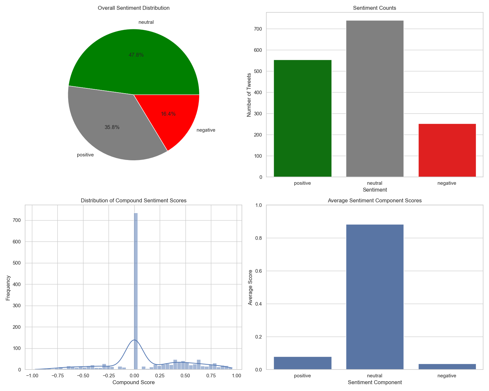

```markdown
# Twitter Sentiment Analysis Tool

A Python-based tool for performing sentiment analysis on Twitter data using Natural Language Processing (NLP) and generating insightful visualizations.



## Features

- 🧠 Sentiment analysis using NLTK's VADER (Valence Aware Dictionary and sEntiment Reasoner)
- 📊 Automatic generation of four different visualizations:
  - Sentiment distribution pie chart
  - Sentiment counts bar chart
  - Compound score distribution histogram
  - Average sentiment component scores bar plot
- 📥 CSV input/output support
- 📈 Detailed sentiment scoring (compound, positive, neutral, negative)
- 📋 Automatic sentiment classification (positive/neutral/negative)
- 🚀 Progress tracking during analysis

## Requirements

- Python 3.x
- pandas
- nltk
- matplotlib
- seaborn

## Installation

1. Clone the repository:
```bash
git clone https://github.com/yourusername/twitter-sentiment-analysis.git
cd twitter-sentiment-analysis
```

2. Install required packages:
```bash
pip install pandas nltk matplotlib seaborn
```

3. Download NLTK VADER lexicon:
```bash
python -c "import nltk; nltk.download('vader_lexicon')"
```

## Usage

### Basic Command Line Usage
```bash
python tweet_sentiment.py <input_csv_file> [text_column_name]
```

- `input_csv_file`: Path to CSV file containing tweets (required)
- `text_column_name`: Name of column containing text (default: 'text')

Example:
```bash
python tweet_sentiment.py data.csv
python tweet_sentiment.py data.csv text
```

### Output
The script will generate:
1. A new CSV file with `_with_sentiment` suffix containing:
   - Original data
   - Four new columns: `compound`, `positive`, `neutral`, `negative`
   - `sentiment` classification column
2. `sentiment_analysis_results.png` with visualizations

### Programmatic Usage
```python
from tweet_sentiment import analyze_tweet_sentiment, visualize_sentiment

# Analyze tweets
df = analyze_tweet_sentiment("tweets.csv", text_column="text")

# Generate visualizations
if df is not None:
    visualize_sentiment(df)
```

## Sentiment Classification
- **Positive**: Compound score ≥ 0.05
- **Neutral**: Compound score between -0.05 and 0.05
- **Negative**: Compound score ≤ -0.05

## File Structure
```
twitter-sentiment-analysis/
├── tweet_sentiment.py      # Main analysis script
├── requirements.txt        # Dependencies
├── README.md               # This file
└── example_tweets.csv      # Sample dataset (optional)
```

## Contributing
Contributions are welcome! Please open an issue to discuss proposed changes, or submit a pull request.

## License
MIT License

## Acknowledgments
- Uses NLTK's VADER sentiment analyzer: https://github.com/nltk/nltk
- Built with pandas, matplotlib, and seaborn
``` 

Copy-paste this directly into your `README.md` file. Formatting is preserved for GitHub Markdown rendering.
